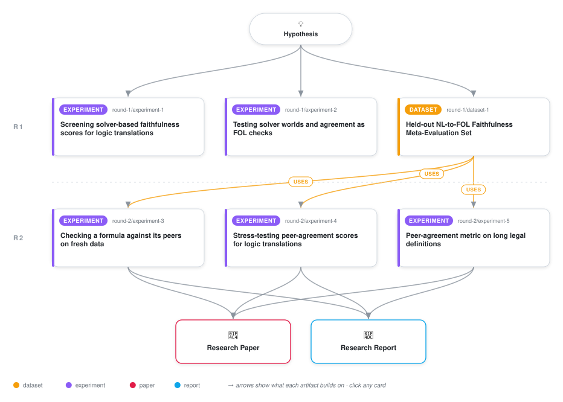

# Gold-free checks of whether a logic formula matches its sentence

<div align="center">

<a href="https://cdn.jsdelivr.net/gh/ai-inventor-papers/ai-invention-abf543-do-sentence-and-formula-generalize-the@fork/run_6eCcKGAwDQQx/workflow.svg">
<picture>
  <source media="(prefers-color-scheme: dark)" srcset="workflow-dark.svg">
  
</picture>
</a>

<sub>🖱️ <b><a href="https://cdn.jsdelivr.net/gh/ai-inventor-papers/ai-invention-abf543-do-sentence-and-formula-generalize-the@fork/run_6eCcKGAwDQQx/workflow.svg">Open the interactive diagram</a></b> — every card links to its artifact folder.</sub>

</div>

> **TL;DR** — We tested whether agreement among nine LLMs' first-order-logic formalizations of the same sentence, checked by an SMT solver without reading predicate names, predicts whether a formalization is faithful to its sentence. On 450 fresh sentences it reached 0.827 AUROC under LLM-panel labels and 0.874 under audited-solver labels, against 0.791 and 0.727 for a gemini-2.5-flash judge, and it is exactly invariant to predicate renaming. The evidence is preliminary: added to a judge-plus-round-trip baseline it gains only about 0.03 AUROC (95% CI -0.001 to 0.066), it ties an existing Dawid-Skene agreement estimator, and it drops to 0.419 AUROC when most systems share an error, which leaves it far behind the judge on long legal definitions (0.705 vs 0.927). It is useful as a complement to a text-reading judge and as a wrong-gold flag (0.84 to 0.86 AUROC), not as a replacement.

<details>
<summary>Full hypothesis</summary>

CLAIM (deepening the cross-output agreement lead; screened in round 1, partly confirmed in round 2, now to be sharpened and confirmed on fresh sentences).
When several NL→FOL outputs exist for one sentence, a candidate's faithfulness can be predicted without gold and without reading the text, from WHERE IT SITS IN THE ENTAILMENT ORDER OF ITS PEERS. The peers are the other systems' outputs or k samples from the same system. The score is called DIRECTIONAL CONSENSUS (DC). For every peer pair (C, P), a lexical-free alignment maps P's vocabulary into C's. The alignment allows arity-preserving bijections, partial maps, and granularity definitions: one predicate mapped to a conjunction of up to two literals, chosen by the solver, not by names. Z3 then classifies the pair as EQUIV, STRONGER (C ⊨ P, P ⊭ C), WEAKER, COMPATIBLE-INCOMPARABLE, CONTRADICTORY or UNALIGNABLE. The DC score is the reliability-weighted mass of peers that are EQUIV to C. Peer reliabilities come from a Dawid–Skene fit over the sentence set. The STRENGTH PROFILE (net stronger versus weaker mass relative to the modal meaning cluster) plus the solver diff to the modal cluster give an error type:
- stronger or weaker, with a predicate present in C but absent from the mode → added condition;
- stronger or weaker, with a predicate absent from C but present in the mode → dropped condition;
- same predicates, differing quantifier → ∀/∃;
- same predicates, incomparable, with antecedent and consequent exchanged → implication direction / 'only';
- contradictory with the same predicates → negation;
- same predicates, slot permutation → argument swap.

MECHANISM (why a positive is expected). Faithful translations of an unambiguous sentence converge on one meaning up to vocabulary; errors are idiosyncratic. The four most frequent real errors (added condition 0.249, ∀/∃ 0.218, dropped condition 0.144, implication direction 0.084; 69.5% of panel-unfaithful items, dataset art_iyzYyaqlqpSX Table 23) mostly change logical STRENGTH, so they appear as strict entailment relations to the consensus. Round-1/2 equivalence clustering discarded two things: the direction, and every vocabulary-mismatched peer. 79% of screen non-equivalences were arity-shape mismatches, and 44.7% of those are panel-faithful. Existing held-out evidence already favours the mechanism. Binary Dawid–Skene agreement scored AUROC 0.787 on 609 panel items, against the cheap judge's 0.762, and per error type it beat gemini-2.5-pro on dropped condition (0.823 vs 0.737) and implication direction (0.873 vs 0.846). It was weakest on added condition (0.726 vs pro 0.803). Directional alignment is predicted to lift exactly that class, because an added conjunct makes a vocab-superset peer STRONGER or WEAKER rather than UNALIGNABLE.

PREDICTED BOUNDARY, part of the claim. DC fails when errors are SHARED: when most systems make the same mistake (a restrictor dropped by convention, 'some' read as at-least-one, an ambiguous sentence). This is the handbook's open 'shared-bias mistranslation' problem. The prediction is testable. DC's within-sentence detection should fall with consensus concentration on the WRONG meaning, highest on ProverQA-style dropped restrictors and on panel-flagged ambiguous items. A cheap text-anchored arbiter should repair part of it: one distinguishing world between the two largest meaning clusters, verbalized and judged against the SENTENCE by gemini-2.5-flash, with one call per sentence shared by all candidates (variant DC+arb, secondary). DC reads no text and never sees gold, so it is predicted to be invariant under solver-verified rewrites, including synonym renaming (the gate that killed the signature and TVJT), and unaffected by benchmark contamination of the judge.

EVIDENCE PARTITION (screen vs confirmation).
- DEVELOPMENT: the existing held-out set (700 sentences × 9 systems, 609 panel items, 7,000 T=0.8 samples). It has already been seen by LC in round 2, so it may be used only to fix DC's alignment search limits, weighting and error-type rules. Freeze them before any fresh label exists.
- CONFIRMATION: FRESH sentences from the Section-1.6 eligible pool (MALLS-v0.1-test remainder, FOLIO-v2-train stories disjoint from both validation sets and from the 700, ProverQA-dev medium/hard), with the top tercile oversampled. Excluded: the 700 held-out, the 360 screen, the 104 contamination and any MED/HELP or tuning sentence. Target about 450 sentences × the same 9 systems (frozen prompt), plus 5 T=0.8 samples for gpt-4.1-mini and llama-3.1-8b.
- LABELS: blinded family-disjoint 3-model panel adjudication (round-1 protocol and calibration gate) on about 750 stratified items, oversampling solver-non-equivalent and minority-cluster candidates to power the error classes. Post-stratified weights. The PANEL label and the AUDITED-SOLVER label are CO-PRIMARY. A test passes only if it passes under both. A test that passes under one label only is reported as label-dependent. This answers the frontier-judge circularity: gemini-2.5-pro drops from 0.827 to 0.738 when switched from panel to solver labels, while LC rises from 0.756 to 0.798.
- SECONDARY LABELLED TRANSFER: the panel also adjudicates the 289 parseable EU-AI-Act pilot formulas of the user (63 definitions; runs used as peers). This is the only exception-heavy material in the run. It carries no grounded-vs-ungrounded comparison.

PRE-REGISTERED TESTS (sentence-clustered paired bootstrap, 2,000 draws, one-sided α=0.05, fresh confirmation set only).
- T1, INCREMENT (the gate LC missed, +0.019 [−0.003, 0.043]). DC adds to the frozen base stack [cheap judge, parse, round-trip NLI, round-trip cosine, structural]. Required: cross-fitted ΔAUROC lower bound > 0.
- T2, BEATS ITS NEIGHBOURS. DC minus majority equivalence clustering (the [33]/[31]-style LC_maj): lower bound > 0. DC minus binary Dawid–Skene: point estimate > 0. DC minus a VOCABULARY-CONFORMITY control (arity-profile agreement and predicate-set Jaccard across peers, the user's pilot metric, which scored 0.787 where covered): lower bound > 0. This control tests the confound that agreement merely rewards conventional vocabulary.
- T3, ERROR TYPES. On panel-unfaithful items, DC's solver-derived type has weighted top-1 ≥ majority-class + 0.10 and ≥ the error-typed gemini-flash judge − 0.05 (round-2 values: majority 0.249, typed judge 0.302). Recall must be ≥ 0.5 on each of added condition, dropped condition and ∀/∃. The within-sentence detection of dropped-condition and implication-direction errors must exceed the cheap judge, with the cheap judge scored on ALL pairs, not a covered subset.
- T4, LONE OUTPUT. With peers = 5 own samples, DC's AUROC exceeds sampling self-consistency (B8) and adds to the frozen base, for gpt-4.1-mini and llama-3.1-8b separately.

SECONDARY, reported and not deciding:
- the frontier gap, stack [cheap judge + parse + DC] minus gemini-2.5-pro, under both labels;
- invariance: false-alarm rate ≤ 5% on solver-verified rewrites of each candidate, by rewrite kind;
- the contamination delta on renamed paraphrases, against the judge's +0.096;
- system-level Kendall τ and pairwise accuracy over the 9 systems;
- per-tercile and per-condition-count AUROC with the slope against the judge;
- DC+arb;
- the shared-bias boundary analysis;
- EU-AI-Act transfer AUROC.
Cost is REPORTED under two accountings and is not a gate. (i) Peers already exist: $0 for DC plus about $0.00003 for the cheap judge. (ii) Peers generated for scoring: about $0.000054 per extra output. There is no unreachable 1/40 ratio test.

DECISION.
- T1 and T2 pass under both labels: supported. Cross-output directional consensus is a gold-free, text-blind faithfulness signal that adds to judge plus round-trip and to equivalence-majority clustering.
- T3 passes as well: it also names the dominant error types.
- T1 passes but T2 fails against the vocabulary control: agreement is vocabulary conformity. That is reported as the finding.
- T1 fails: the round-2 non-confirmation stands and cross-output agreement is closed.

CLOSED STRANDS, one sentence each in the paper, no further budget:
- the monotonicity signature: held-out 0.642–0.656 < cheap judge 0.762; all five round-2 verdicts failed, including error-type naming (top-1 0.111) and RENAME_FIXED;
- TVJT: the complexity crossover reversed on current systems, −0.098 [−0.184, −0.014];
- instance-consequence NLI with DeBERTa: null.
The zero-LLM rule-marker polarity (A3) may enter the T1 stack only as a pre-declared secondary feature, since LC + A3 added +0.030 [0.005, 0.057] in round 2.

DELIVERABLES: directional_consensus(text, fol, peers) → {score, strength_profile, error_type, coverage, cost}, plus align_pair(fol_a, fol_b) and pair_relation(fol_a, fol_b, map). Each has a one-line statement of what it measures. The existing dataset is extended with the fresh confirmation set.

</details>

[](https://ai-inventor-papers.github.io/ai-invention-abf543-do-sentence-and-formula-generalize-the/fork/run_6eCcKGAwDQQx/) [](https://ai-inventor-papers.github.io/ai-invention-abf543-do-sentence-and-formula-generalize-the/fork/run_6eCcKGAwDQQx/interactive.html)

[](https://cdn.jsdelivr.net/gh/ai-inventor-papers/ai-invention-abf543-do-sentence-and-formula-generalize-the@fork/run_6eCcKGAwDQQx/paper.pdf) [](https://cdn.jsdelivr.net/gh/ai-inventor-papers/ai-invention-abf543-do-sentence-and-formula-generalize-the@fork/run_6eCcKGAwDQQx/report.pdf) [](https://cdn.jsdelivr.net/gh/ai-inventor-papers/ai-invention-abf543-do-sentence-and-formula-generalize-the@fork/run_6eCcKGAwDQQx/round-2/report.pdf) [](https://github.com/ai-inventor-papers/ai-invention-abf543-do-sentence-and-formula-generalize-the/tree/fork/run_6eCcKGAwDQQx/paper_latex)

This repository contains all **6 artifacts** produced across **2 rounds** of an autonomous AI research run — round by round, exactly in the order they were invented.

## Round 1

| Artifact | Type | Demo | Source | Builds on |
|----------|------|------|--------|-----------|
| **[Screening solver-based faithfulness scores for logic transla…](https://github.com/ai-inventor-papers/ai-invention-abf543-do-sentence-and-formula-generalize-the/tree/fork/run_6eCcKGAwDQQx/round-1/experiment-1)** | [](https://github.com/ai-inventor-papers/ai-invention-abf543-do-sentence-and-formula-generalize-the/tree/fork/run_6eCcKGAwDQQx/round-1/experiment-1) | [](https://colab.research.google.com/github/ai-inventor-papers/ai-invention-abf543-do-sentence-and-formula-generalize-the/blob/fork/run_6eCcKGAwDQQx/round-1/experiment-1/demo/method_code_demo.ipynb) | [](https://github.com/ai-inventor-papers/ai-invention-abf543-do-sentence-and-formula-generalize-the/tree/fork/run_6eCcKGAwDQQx/round-1/experiment-1/src) | — |
| **[Testing solver worlds and agreement as FOL checks](https://github.com/ai-inventor-papers/ai-invention-abf543-do-sentence-and-formula-generalize-the/tree/fork/run_6eCcKGAwDQQx/round-1/experiment-2)** | [](https://github.com/ai-inventor-papers/ai-invention-abf543-do-sentence-and-formula-generalize-the/tree/fork/run_6eCcKGAwDQQx/round-1/experiment-2) | [](https://colab.research.google.com/github/ai-inventor-papers/ai-invention-abf543-do-sentence-and-formula-generalize-the/blob/fork/run_6eCcKGAwDQQx/round-1/experiment-2/demo/method_code_demo.ipynb) | [](https://github.com/ai-inventor-papers/ai-invention-abf543-do-sentence-and-formula-generalize-the/tree/fork/run_6eCcKGAwDQQx/round-1/experiment-2/src) | — |
| **[Held-out NL-to-FOL Faithfulness Meta-Evaluation Set](https://github.com/ai-inventor-papers/ai-invention-abf543-do-sentence-and-formula-generalize-the/tree/fork/run_6eCcKGAwDQQx/round-1/dataset-1)** | [](https://github.com/ai-inventor-papers/ai-invention-abf543-do-sentence-and-formula-generalize-the/tree/fork/run_6eCcKGAwDQQx/round-1/dataset-1) | [](https://colab.research.google.com/github/ai-inventor-papers/ai-invention-abf543-do-sentence-and-formula-generalize-the/blob/fork/run_6eCcKGAwDQQx/round-1/dataset-1/demo/data_code_demo.ipynb) | [](https://github.com/ai-inventor-papers/ai-invention-abf543-do-sentence-and-formula-generalize-the/tree/fork/run_6eCcKGAwDQQx/round-1/dataset-1/src) | — |

## Round 2

| Artifact | Type | Demo | Source | Builds on |
|----------|------|------|--------|-----------|
| **[Checking a formula against its peers on fresh data](https://github.com/ai-inventor-papers/ai-invention-abf543-do-sentence-and-formula-generalize-the/tree/fork/run_6eCcKGAwDQQx/round-2/experiment-3)** | [](https://github.com/ai-inventor-papers/ai-invention-abf543-do-sentence-and-formula-generalize-the/tree/fork/run_6eCcKGAwDQQx/round-2/experiment-3) | [](https://colab.research.google.com/github/ai-inventor-papers/ai-invention-abf543-do-sentence-and-formula-generalize-the/blob/fork/run_6eCcKGAwDQQx/round-2/experiment-3/demo/method_code_demo.ipynb) | [](https://github.com/ai-inventor-papers/ai-invention-abf543-do-sentence-and-formula-generalize-the/tree/fork/run_6eCcKGAwDQQx/round-2/experiment-3/src) | <sub><i>uses:</i><br/>[dataset‑1&nbsp;(R1)](https://github.com/ai-inventor-papers/ai-invention-abf543-do-sentence-and-formula-generalize-the/tree/fork/run_6eCcKGAwDQQx/round-1/dataset-1)</sub> |
| **[Stress-testing peer-agreement scores for logic translations](https://github.com/ai-inventor-papers/ai-invention-abf543-do-sentence-and-formula-generalize-the/tree/fork/run_6eCcKGAwDQQx/round-2/experiment-4)** | [](https://github.com/ai-inventor-papers/ai-invention-abf543-do-sentence-and-formula-generalize-the/tree/fork/run_6eCcKGAwDQQx/round-2/experiment-4) | [](https://colab.research.google.com/github/ai-inventor-papers/ai-invention-abf543-do-sentence-and-formula-generalize-the/blob/fork/run_6eCcKGAwDQQx/round-2/experiment-4/demo/method_code_demo.ipynb) | [](https://github.com/ai-inventor-papers/ai-invention-abf543-do-sentence-and-formula-generalize-the/tree/fork/run_6eCcKGAwDQQx/round-2/experiment-4/src) | <sub><i>uses:</i><br/>[dataset‑1&nbsp;(R1)](https://github.com/ai-inventor-papers/ai-invention-abf543-do-sentence-and-formula-generalize-the/tree/fork/run_6eCcKGAwDQQx/round-1/dataset-1)</sub> |
| **[Peer-agreement metric on long legal definitions](https://github.com/ai-inventor-papers/ai-invention-abf543-do-sentence-and-formula-generalize-the/tree/fork/run_6eCcKGAwDQQx/round-2/experiment-5)** | [](https://github.com/ai-inventor-papers/ai-invention-abf543-do-sentence-and-formula-generalize-the/tree/fork/run_6eCcKGAwDQQx/round-2/experiment-5) | [](https://colab.research.google.com/github/ai-inventor-papers/ai-invention-abf543-do-sentence-and-formula-generalize-the/blob/fork/run_6eCcKGAwDQQx/round-2/experiment-5/demo/method_code_demo.ipynb) | [](https://github.com/ai-inventor-papers/ai-invention-abf543-do-sentence-and-formula-generalize-the/tree/fork/run_6eCcKGAwDQQx/round-2/experiment-5/src) | <sub><i>uses:</i><br/>[dataset‑1&nbsp;(R1)](https://github.com/ai-inventor-papers/ai-invention-abf543-do-sentence-and-formula-generalize-the/tree/fork/run_6eCcKGAwDQQx/round-1/dataset-1)</sub> |

## Repository Structure

Artifacts are grouped by the round of invention that produced them. Each
artifact has its own folder with source code and a self-contained demo:

```
.
├── round-1/                         # One folder per round of invention
│   ├── experiment-1/
│   │   ├── README.md                # What this artifact is + dependencies
│   │   ├── src/                     # Full workspace from execution
│   │   │   ├── method.py            # Main implementation
│   │   │   ├── method_out.json      # Full output data
│   │   │   └── ...                  # All execution artifacts
│   │   └── demo/                    # Self-contained demo
│   │       └── method_code_demo.ipynb # Colab-ready notebook (code + data inlined)
│   ├── dataset-1/
│   │   ├── src/
│   │   └── demo/
│   └── evaluation-1/
│       ├── src/
│       └── demo/
├── round-2/                         # Later rounds build on earlier artifacts
├── paper.pdf                        # Research paper
├── paper_latex/                     # LaTeX source files
├── report.pdf                       # Full internal report — every experiment, table and dead end
├── report_latex/                    # LaTeX source of the report
├── chat/                            # Every prompt, response and tool call, per module
├── workflow.svg                     # Artifact dependency diagram (this page's header)
└── README.md
```

## Running Notebooks

### Option 1: Google Colab (Recommended)

Click the "Open in Colab" badges above to run notebooks directly in your browser.
No installation required!

### Option 2: Local Jupyter

```bash
# Clone the repo
git clone https://github.com/ai-inventor-papers/ai-invention-abf543-do-sentence-and-formula-generalize-the
cd ai-invention-abf543-do-sentence-and-formula-generalize-the

# Install dependencies
pip install jupyter

# Run any artifact's demo notebook
jupyter notebook <artifact_folder>/demo/
```

## Source Code

The original source files are in each artifact's `src/` folder.
These files may have external dependencies - use the demo notebooks for a self-contained experience.

---
*Generated by AI Inventor Pipeline - Automated Research Generation*
